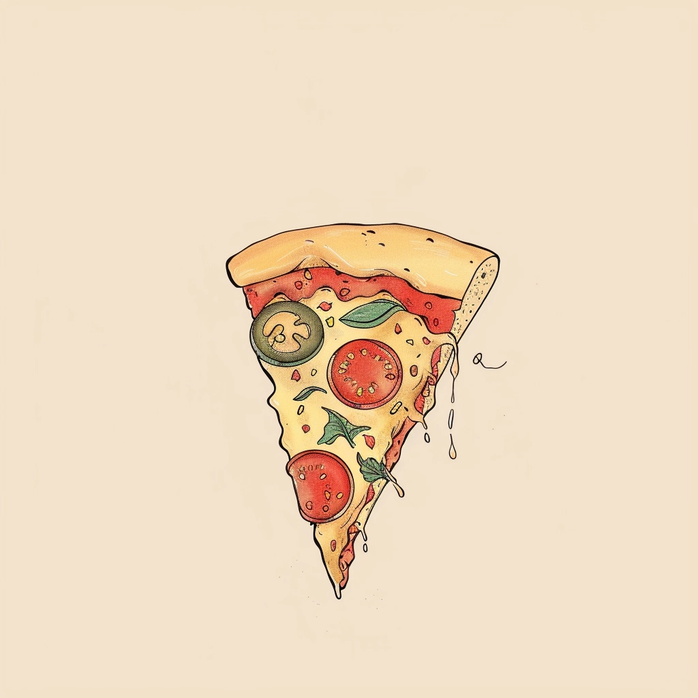
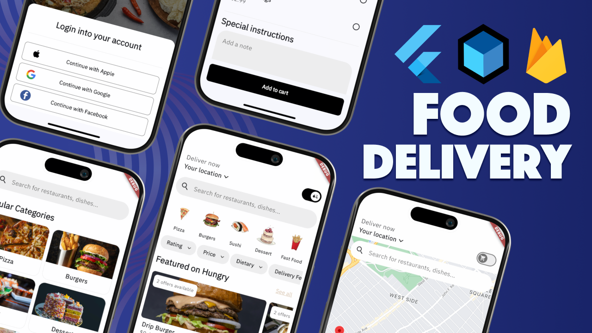
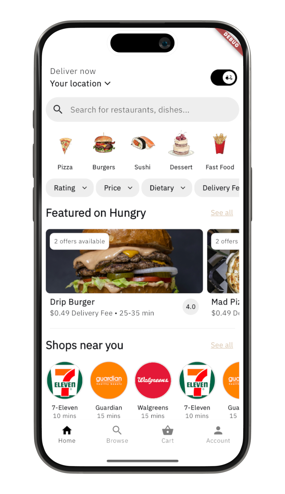
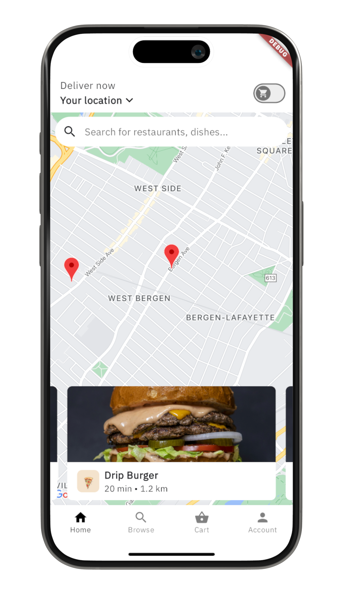
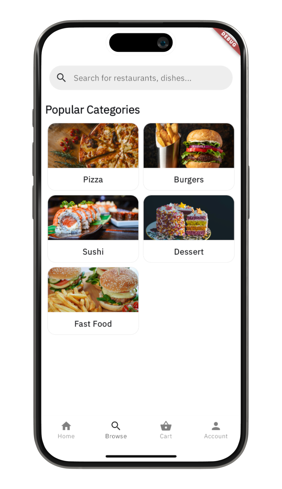
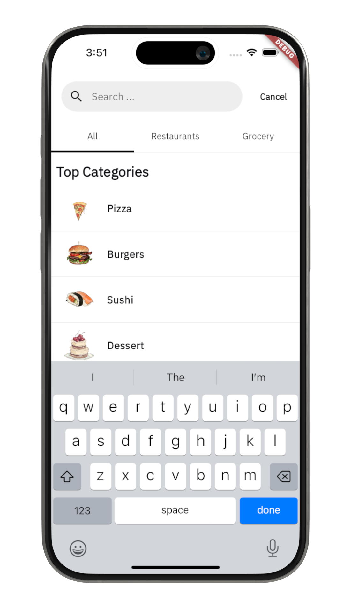
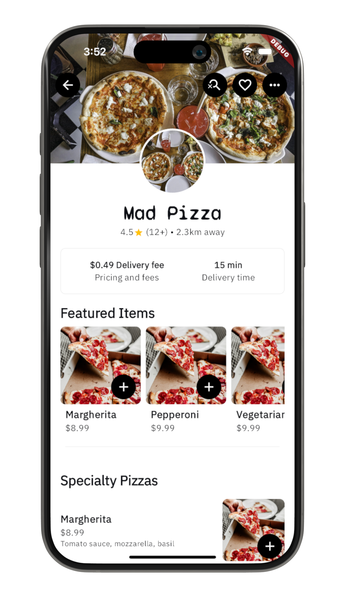
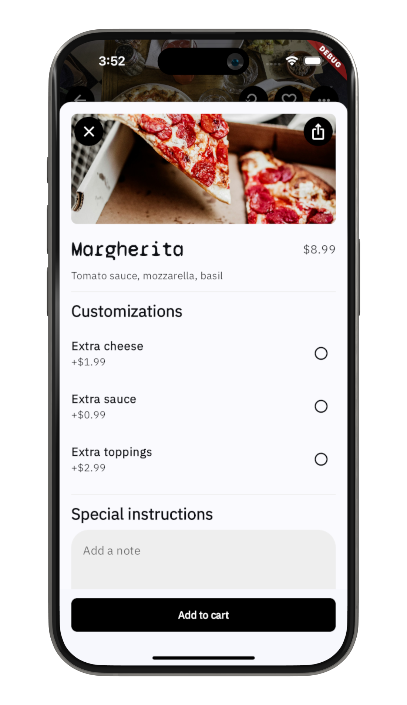
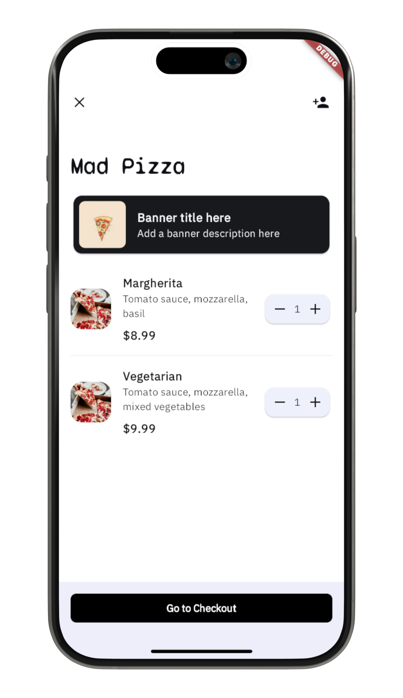
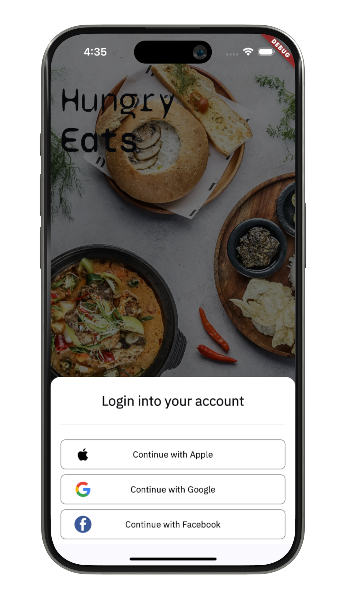

# Hungry
<table>
  <tr>
    <td></td>
    <td>
      <strong>Hungry</strong> is a food delivery app template. It gives you a consumer-facing solution that replicates the core design and features of the popular food delivery platform, Uber Eats. If you're keen on creating a food delivery app, this template offers you the starting point for your project with Flutter, Firebase and Google Maps Platform. 
    </td>
  </tr>
</table>

YouTube video: https://youtu.be/6DPOeOagTlE

If you're looking for the complete template for a Doctor Booking app:

## Screenshots
| |  |  |
|:---:|:---:|:---:|
| Home Screen | Home Screen (Pick-up) | Search Categories |
|  |  |  |
| Search Categories (List) Screen | Restaurant Details Screen | Menu Item Details View |
| |  |  |
| Cart Screen | Welcome Screen |  |
